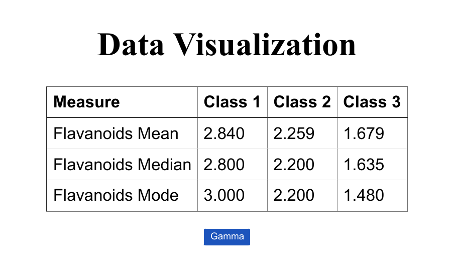
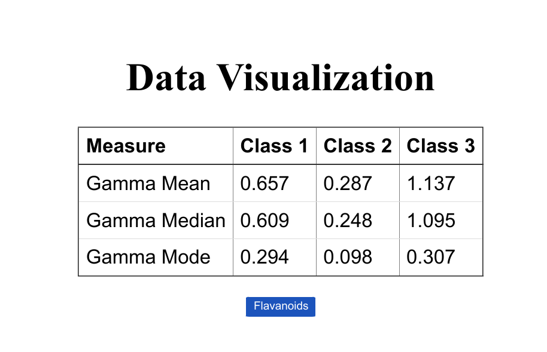

# Data Visualization Task

This project is a data visualization task built with Create React App (CRA) and managed using Yarn.

## Description

Provide a brief description of your data visualization task. Mention its purpose, what data it visualizes, and any important context.

## Table of Contents

-  [Installation](#installation)
-  [Usage](#usage)
-  [Build](#build)
-  [License](#license)

# Installation

To set up and run this project locally, follow these steps:

1. **Clone the Repository:**

https://github.com/satishpwebdev/data_task.git

2. **Navigate to the Project Directory**
   cd data_task

3. **Install Dependencies:**
   yarn install

4. **Start Development Sever:**
   yarn start

5.**Open Your Browser:**

Open your web browser and go to http://localhost:3000 to view the application.

# Usage

Check all the visualized data:

# Build

**Run the build command:**
yarn build

# License

This project is licensed under the MIT License.
